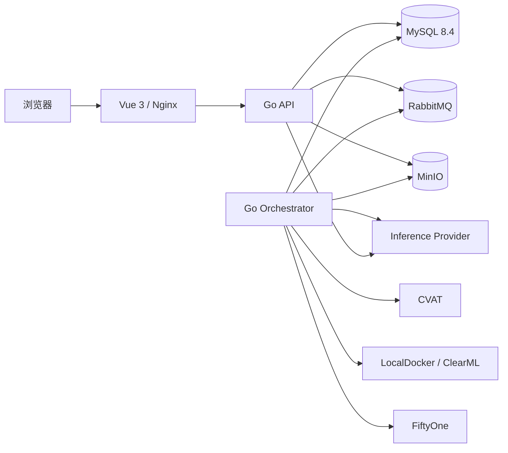

# VisionAI 架构

## 运行拓扑

Go API 是同步命令、查询、权限和审计入口；Orchestrator 消费领域事件并执行外部长任务。MySQL 是治理事实源，MinIO 保存媒体、Manifest、标注、训练、评估和模型制品；外部系统 ID 只保存在 Binding。

## 代码边界

- `internal/modules/visionai`：项目、资产、标注、数据集、训练、评估、模型、部署、反馈、资源与集成领域。
- `internal/platform/*`：Storage、MessageBus、CVAT、Training、FiftyOne、Inference 等 Provider 边界。
- `cmd/server`：HTTP API、迁移、Outbox Publisher。
- `cmd/orchestrator`：Inbox 幂等消费、作业状态机、重试与恢复。
- `frontend/src/views/ai-platform`：统一生命周期工作台。

## 一致性

写请求在同一数据库事务中保存业务对象、PlatformJob、OutboxEvent 和 AuditEvent。Publisher 将事件投递至 RabbitMQ；Orchestrator 使用 InboxEvent 去重。外部执行分阶段写回 JobAttempt、Binding 和不可变领域版本。重启后，未终态作业可继续或安全重试。

## 不可变对象

AnnotationRevision、DatasetVersion、TrainingRun 快照、EvaluationRun 结果、ModelVersion 制品与 DeploymentRevision 不可原地覆盖。状态变化新增记录或显式推进生命周期；线上推理通过 DeploymentRevision 反查 ModelVersion → EvaluationRun → TrainingRun → DatasetVersion → AnnotationRevision。

## 安全

JWT + 租户 RBAC + 项目成员数据域在后端执行。外部凭证以 Secret Ref 表达，日志不输出 Secret。预签名 URL 有短有效期和项目授权。模型生产审批强制职责分离，关键配置和审批证据保存不可变摘要。
